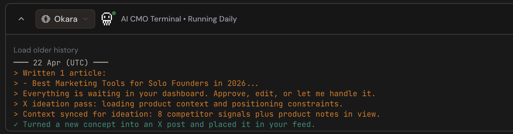
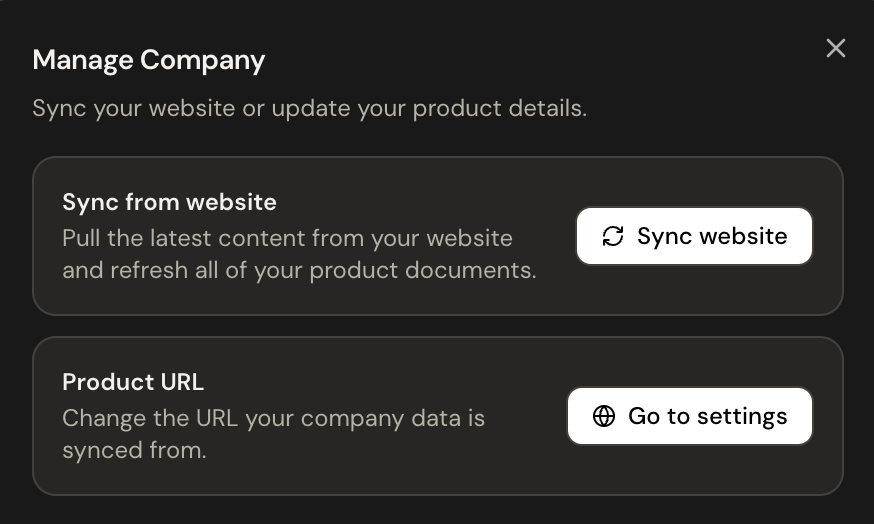

When you first arrive at Okara, you are not setting up a tool, you are bringing on a team member.

The CMO works with a network of specialized agents: one focused on SEO, another on GEO, one for Reddit, another for LinkedIn, X, and so on. The CMO works with all of them, pulling their findings together and deciding what each one should focus on. You get one coherent marketing operation.

Getting started is simple. You enter your website URL at [https://okara.ai/](https://okara.ai/), and the CMO begins its initialization.

This is not a passive scan. During this phase, the CMO is actively working:

- It prepares your strategy documents, using your site's content and positioning as the foundation.
- It finds your competitors and starts analyzing how they show up across search and Al-generated results.
- It runs a detailed SEO and GEO analysis, looking at how well your site performs in traditional search and how visible it is inside AI tools like ChatGPT and Perplexity.
- It works with each agent to build your first set of actions; concrete, prioritized tasks you can act on right away.

By the time initialization is done, the CMO has a clear picture of where you stand and what needs to happen next. Everything that follows builds on this.

### The CMO Feed

The Feed is the main surface you will come back to every day. It is a live stream of tasks, built by the CMO working alongside each of its agents. It is not a static todo list, it reflects what is actually happening with your site and your channels right now.

The tasks the CMO surfaces cover the full range of what you need:

- **SEO and GEO fixes**: Specific issues on your site that are holding back your search visibility or your presence in AI-generated answers.
- **Articles**: Fully drafted content, ready for publishing, built around gaps the CMO has spotted.
- **Reddit opportunities**: Relevant threads where a thoughtful reply from you would land well, along with suggested content to post.
- **LinkedIn and X posts**: Drafted content for both platforms, written in your brand voice, to maximize your reach and to get more leads.

#### Working with tasks

Every item in the Feed is clickable. Opening a task shows you the full detail.

For articles, you can read the full draft right there. If you want a different angle, you can ask the CMO to suggest a fix by clicking the "Ask CMO" button. It will work with the content agent and create a revised version. Once you are happy with it, you can click "Publish" to connect your site and bring it live. Once you are done, mark it complete, this moves it to your archive and keeps the Feed focused on what is still open.

Similarly for social posts; LinkedIn, X, or Reddit; you can use the CMO chat to edit the content before it goes anywhere. And then click the "post" button to publish the content on your connected account.

<Info>
  **Nothing in the Feed publishes itself**. Every action needs your approval before anything happens. A human in the loop gives you more control and helps the agent train as well. Articles can be configured to be auto posted.
</Info>

### The Terminal

The Terminal gives you a direct window into how the CMO thinks and works. Where the Feed shows you outputs, the Terminal shows you the process behind them.

You get a daily digest here. It is a summary of what the CMO has been working on and what it has found. Beyond the digest, you can follow the CMO's reasoning as it works through a problem: how it frames the challenge, which agents it leans on, and how it arrives at a recommendation.

This transparency is intentional. If a suggestion surprises you, the Terminal is where you find the thinking behind it.

### The Company Panel

The Company Panel is the CMO's working knowledge base about your business. It is both a report and framework for you to uncover more details about your business, and also a way for you to fine tune the agent, because the agent uses this knowledge base to create strategy, find future opportunities and generate leads.

The panel holds:

- **Marketing strategy**: CMO creates this document for you to help you understand the direction you should take your company in. This gives you a detailed picture of your ICP, your 30 day marketing roadmap and a detailed guidance on which channels deserve the most attention. This is a very valuable document.
- **Brand voice**: The tone, language, and style that should carry through every piece of content.
- **Competitor analysis**: A structured view of how your competitors are positioning themselves.
- **Product information**: What you offer, who it is for, and what makes it different.

You can download, copy or edit the document. These documents feed back into the memory of the agent. Keeping these documents accurate is one of the most effective things you can do to improve the quality of the CMO's output.

If something is not quite right or matching what your company does, you can also trigger a manual resync. To get this, click on settings, from the top right corner of your Company panel. This is also useful, when you have made meaningful changes to your site and want to pull the latest information.

A resync will delete all of your existing documents related to the company, marketing and brand, and create new documents.

### The Analytics Window

The Analytics Window gives you a clear, detailed view of how your site is actually doing; both in technical health and search visibility.

You get a full set of metrics here; the measures of page speed, accessibility, and technical quality that affect both user experience and how search engines evaluate your site.

Beyond the technical numbers, the Analytics Window gives you a thorough view of your SEO position:

- Backlinks and top referring domains: Which external sites link to yours and how much authority they carry.
- Al Readiness Score: A measure of how visible and well-structured your content is for AI-powered search tools, which is increasingly where discovery happens.
- SEO issue checks: A prioritized list of the most important problems on your site, from missing metadata to content gaps to structural issues that are costing you ranking.

The checks here are the ones that matter most. They are ranked so you always know where to focus first.

### The Feedback Loop: Putting It All to Use

The CMO chat does more than answer questions. It is a working tool for thinking through strategy, creating content, and steering the direction of your marketing.

Here is what you can do with it:

- Brainstorm strategy: Talk through a direction you are considering, test an idea, or ask the CMO to weigh in on a new approach. Since the agent has the entire context of your company and access to the realtime information with Google, the insights generated here are very valuable and grounded.
- Generate more content: Ask for additional articles and posts about what the Feed has already surfaced.
- Talk to a specialized agent directly: If you want the SEO agent's view on a specific keyword,or resolve a SEO issue, you can steer the conversation that way.
- Work with files: You can attach files directly to the chat. Upload a brief, a document, or an existing piece of content, and the CMO will use it as context for whatever you are working on.

### TL;DR: CMO on day one

<Steps>
  <Step title="Start with the Company Panel">
    Read through your strategy documents and competitor analysis. This is where the CMO lays out exactly where your business stands and where it should go. It is a fast, clear way to understand your own marketing position and a ready-made plan to act on.
  </Step>
  <Step title="Post your first article.">
    Connect your site, review the drafts in your Feed, and publish. This is the fastest way to see the CMO working for you in the real world.
  </Step>
  <Step title="Think about leads">
    If you want people actively discovering you, start with Reddit; the CMO finds the right threads and drafts replies you can post. If you want broader visibility, connect LinkedIn and X and start publishing there too.
  </Step>
  <Step title="Connect coding agent">
    It will require code changes or edits to your site. But they are worth doing. Now with coding agent, you can do this autonomously. These are the structural improvements that quietly compound your ranking over time.
  </Step>
</Steps>

Read top to bottom, that is the order. Company Panel → Articles → Social → SEO fixes. Follow it and you will get real value out of the CMO from day one.